# CourseForge – Auto Mode Pipeline Flowchart

> **Related docs:** [Developer Onboarding](./developer-onboarding.md) · [Firestore Debug Rules](./firestore-debug-rules.md) · [Architecture](./ARCHITECTURE.md)

---

## Legend

| Shape / Style | Meaning |
| --- | --- |
| Rectangle | Auto Mode step (system action) |
| Diamond `{ }` | Decision point |
| Rounded rectangle | User action |
| Parallelogram (note) | Debug log event emitted |
| Dashed border | AI / OCR action |
| `[error]` label | Error path |

---

## Full Pipeline Flowchart

```mermaid
flowchart TD
    Start([User selects Auto Mode])
    Start --> EnvCheck

    subgraph ENV["Environment Preparation"]
        EnvCheck{Running in\nbrowser extension?}
        EnvCheck -- Yes --> TabCapture[Activate tab screenshot\nautoCaptureService]
        EnvCheck -- No --> FileCapture[Accept file upload\nor drag-drop capture]
        TabCapture --> EnvReady
        FileCapture --> EnvReady
        EnvReady([Environment ready])
    end

    EnvReady --> CoverStep

    subgraph COVER["Step 1 – Cover Capture"]
        CoverStep([Prompt: capture cover image])
        CoverStep --> LogCaptureStart[/LOG: auto_capture_start\nstep = cover/]
        LogCaptureStart --> CaptureImage[autoCaptureService:\nscreenshot or load file]
        CaptureImage --> CropSuccess1{Auto-crop\nsucceeded?}
        CropSuccess1 -- Yes --> LogCropOK1[/LOG: auto_crop_success/]
        CropSuccess1 -- No  --> LogCropFail1[/LOG: auto_crop_failure/]
        LogCropFail1 --> ManualCrop1[User adjusts crop\nboundaries manually]
        ManualCrop1 --> CropDone1
        LogCropOK1  --> CropDone1
        CropDone1 --> ModerationCheck1{Image moderation\ncheck}
        ModerationCheck1 -- allow --> LogCaptureEnd1[/LOG: auto_capture_complete\nstep = cover/]
        ModerationCheck1 -- pending-admin-review --> HoldCover[Set imageModerationState\n= pending-admin-review\nRemain local-only]
        ModerationCheck1 -- blocked-explicit-content --> BlockCover[Show block message\nAbort Auto Mode]
        LogCaptureEnd1 --> CoverOCR
    end

    CoverOCR --> TitleStep

    subgraph TITLE["Step 2 – Copyright Page Capture"]
        TitleStep([Prompt: capture copyright page])
        TitleStep --> LogCaptureStart2[/LOG: auto_capture_start\nstep = title/]
        LogCaptureStart2 --> CaptureTitle[autoCaptureService:\ncapture copyright page]
        CaptureTitle --> CropSuccess2{Auto-crop\nsucceeded?}
        CropSuccess2 -- Yes --> LogCropOK2[/LOG: auto_crop_success/]
        CropSuccess2 -- No  --> LogCropFail2[/LOG: auto_crop_failure/]
        LogCropFail2 --> ManualCrop2[User adjusts crop]
        ManualCrop2 --> CropDone2
        LogCropOK2  --> CropDone2
        CropDone2 --> TitleOCR[autoOcrService:\nrun OCR on copyright page]
        TitleOCR --> OCRSuccess1{OCR\nsucceeded?}
        OCRSuccess1 -- Yes --> LogOCROK1[/LOG: ocr_success/]
        OCRSuccess1 -- No  --> LogOCRFail1[/LOG: ocr_failure/]
        LogOCRFail1 --> FallbackManual[Offer Manual Mode\nfallback]
        LogOCROK1 --> ExtractMeta[textbookAutoExtractionService:\nscoreMetadataConfidence]
        ExtractMeta --> LogMetaExtracted[/LOG: metadata_extracted/]
        LogMetaExtracted --> CaptureEnd2[/LOG: auto_capture_complete\nstep = title/]
    end

    CaptureEnd2 --> TocStep

    subgraph TOC["Step 3 – TOC Capture (multi-page loop)"]
        TocStep([Prompt: capture first TOC page])
        TocStep --> LogTocCapture[/LOG: auto_capture_start\nstep = toc/]
        LogTocCapture --> CaptureTocPage[autoCaptureService:\ncapture TOC page N]
        CaptureTocPage --> TocOCR[autoOcrService:\nrun OCR on TOC page]
        TocOCR --> TocOCRSuccess{OCR\nsucceeded?}
        TocOCRSuccess -- No  --> LogTocOCRFail[/LOG: ocr_failure/]
        LogTocOCRFail --> TocContinue
        TocOCRSuccess -- Yes --> LogTocExtracted[/LOG: toc_extracted/]
        LogTocExtracted --> StoreTocPage[Append TocPage to tocPages\nstate array]
        StoreTocPage --> TocContinue{Capture\nanother TOC page?}
        TocContinue -- Yes --> CaptureTocPage
        TocContinue -- No  --> TocStitch
        TocStitch[stitchTocPages:\nmerge & deduplicate all TocPages]
        TocStitch --> LogTocStitch[/LOG: toc_stitch\nconfidence = stitchingConfidence/]
    end

    LogTocStitch --> AbuseCheck

    subgraph ABUSE["Anti-Abuse Check"]
        AbuseCheck{Abuse detection\ntriggers?}
        AbuseCheck -- No --> Preview
        AbuseCheck -- "Rate limit exceeded" --> WarnRate[/LOG: warning\n'rate limit exceeded'/]
        AbuseCheck -- "Duplicate ISBN exists" --> DuplicateFlow
        WarnRate --> BlockAbuse[Show user warning\nAbort or throttle]

        subgraph DuplicateFlow["Duplicate Textbook Resolution"]
            DuplicateCheck([findTextbookByISBN:\nISBN match found])
            DuplicateCheck --> ResolutionUI[Show conflict resolution UI:\noverwrite_auto or merge_dedupe]
            ResolutionUI --> UserPickResolution([User selects resolution mode])
            UserPickResolution --> BuildPlan[autoTextbookConflictService:\nbuildAutoConflictResolutionPlan]
        end

        BuildPlan --> Preview
    end

    subgraph PREVIEW["Step 4 – Preview & User Edits"]
        Preview([Show metadata form\nwith confidence dots])
        Preview --> UserReview([User reviews fields])
        UserReview --> UserEdits{User edits\na field?}
        UserEdits -- Yes --> SetManual[Set field sourceType = 'manual'\nconfidence = 1.0]
        SetManual --> LogUserAction[/LOG: user_action/]
        LogUserAction --> UserEdits
        UserEdits -- No / Done --> SaveReady
        SaveReady([All required fields\nfilled. Ready to save.])
    end

    SaveReady --> Save

    subgraph SAVE["Step 5 – Firestore Save"]
        Save([User clicks Save])
        Save --> PersistLocal[autoTextbookPersistenceService:\nwrite to IDB]
        PersistLocal --> ModerationGate{Moderation\nstate allows\ncloud sync?}
        ModerationGate -- allow --> CloudSync[Sync service:\nupload to Firestore]
        ModerationGate -- pending-admin-review --> LocalOnly[Stay local-only\nuntil admin approves]
        ModerationGate -- blocked-explicit-content --> LocalOnly
        CloudSync --> Done([Textbook created ✓])
        LocalOnly --> Done
    end

    FallbackManual --> ManualMode([Manual Mode: user types all fields])
    BlockCover --> ManualMode
    BlockAbuse --> ManualMode
    ManualMode --> Done

    style ENV fill:#e8f4fd,stroke:#2196f3
    style COVER fill:#fff8e1,stroke:#ff9800
    style TITLE fill:#fff8e1,stroke:#ff9800
    style TOC fill:#fff8e1,stroke:#ff9800
    style ABUSE fill:#fce4ec,stroke:#e91e63
    style PREVIEW fill:#e8f5e9,stroke:#4caf50
    style SAVE fill:#f3e5f5,stroke:#9c27b0
```

---

## Stage-by-Stage Summary

## Bugfix UX Notes (2026-04-02)

- During OCR processing, capture actions are now interaction-locked to prevent overlapping requests.
- Drag-and-drop zones are visually disabled while OCR is running, then automatically re-enabled when OCR completes.
- OCR processing status now overlays the action button area so waiting state is obvious.
- Auto-scroll now performs one-shot positioning only and does not continue fighting manual user scrolling.
- After accepting Cover or Copyright metadata, the view returns to the next step instructions/drop zone region.
- Optional metadata fields are collapsed behind a show/hide control to keep primary fields and Accept flow visible.
- Upload review overlay is raised above workflow cards to avoid clipping inside container boundaries.
- TOC entries without numeric section IDs are treated as Additional Section rather than flagged as missing number.
- Single-page ancillary TOC rows now infer pageEnd equal to pageStart when only one page is provided.

### Stage 1 – Environment Preparation

| Task | Service | Debug Event |
| --- | --- | --- |
| Detect context (extension vs webapp) | `autoCaptureService` | — |
| Activate tab screenshot (extension) | `autoCaptureService` | — |
| Accept file upload (webapp) | `autoCaptureService` | — |

---

### Stage 2 – Cover Capture

| Task | Service | Debug Event |
| --- | --- | --- |
| Screenshot / file load | `autoCaptureService` | `auto_capture_start` (cover) |
| Auto-crop | `autoCaptureService` | `auto_crop_success` / `auto_crop_failure` |
| Image moderation | `coverImageService` | `warning` (if flagged) |
| Capture complete | — | `auto_capture_complete` (cover) |

**Decision points:**

- Auto-crop failure → user adjusts crop manually before continuing.
- Moderation `pending-admin-review` → textbook marked local-only; flow continues with warning banner.
- Moderation `blocked-explicit-content` → abort Auto Mode, offer Manual Mode.

---

### Stage 3 – Copyright Page Capture

| Task | Service | Debug Event |
| --- | --- | --- |
| Screenshot / file load | `autoCaptureService` | `auto_capture_start` (title) |
| Auto-crop | `autoCaptureService` | `auto_crop_success` / `auto_crop_failure` |
| OCR | `autoOcrService` | `ocr_success` / `ocr_failure` |
| Metadata extraction | `textbookAutoExtractionService` | `metadata_extracted` |
| Capture complete | — | `auto_capture_complete` (title) |

**Decision points:**

- OCR failure → offer Manual Mode fallback.

---

### Stage 4 – TOC Capture (loop)

| Task | Service | Debug Event |
| --- | --- | --- |
| Screenshot each TOC page | `autoCaptureService` | `auto_capture_start` / `auto_capture_complete` (toc) |
| OCR each page | `autoOcrService` | `ocr_success` / `ocr_failure` |
| Extract page chapters | `textbookAutoExtractionService` | `toc_extracted` |
| Stitch all pages | `stitchTocPages()` | `toc_stitch` |

**Decision points:**

- User controls loop: "Capture another TOC page?" prompt after each page.
- OCR failure on a page → that page is skipped; stitching continues with remaining pages.

**UI behavior and data mapping:**

- During TOC capture, the editor now shows TOC target fields (chapter/section/subsection-style rows) instead of metadata fields.
- Parsed page numbers are editable in TOC editor fields and retained for downstream chapter/section guidance.
- Chapter end page can be inferred from the next chapter start page when OCR does not provide an explicit end page.
- Module-based books preserve `Module` naming in the TOC preview instead of forcing `Chapter` labels.
- Ancillary titled entries without numeric prefixes (for example `Module Wrap-Up`) are retained as unnumbered sections and are not auto-numbered into the lesson sequence.

---

### Stage 5 – Anti-Abuse Checks

| Check | Trigger | Action |
| --- | --- | --- |
| Rate limit | Too many captures in time window | Warn user, log `warning`, offer Manual Mode |
| Duplicate ISBN | `findTextbookByISBN()` returns a match | Show conflict resolution UI |

**Conflict resolution options:**

- `overwrite_auto` – delete existing chapters/sections, replace with Auto TOC result.
- `merge_dedupe` – match by index then title; keep existing IDs where possible; no deletions.

---

### Stage 6 – Preview & User Edits

Each metadata field shows a confidence dot (green / yellow / red / grey):

| Field | Confidence dot | Editable? |
| --- | --- | --- |
| Title | Yes | Yes |
| Author | Yes | Yes |
| ISBN | Yes | Yes |
| Edition | Yes | Yes |
| Grade | Yes | Yes |
| Subject | Yes | Yes |
| Year | Yes | Yes |

User edits set `sourceType: "manual"` and `confidence: 1.0` for that field.

Additional metadata persistence rules:

- Manual edits to Additional ISBNs persist across later cover/copyright captures and OCR merges.
- Use `Related ISBNs (typed)` for labeled variants (teacher, digital, workbook, assessment, or custom note text).

---

### Stage 7 – Save

- `autoTextbookPersistenceService` writes to IDB.
- Sync service checks moderation state and user cloud-access policy before any Firestore write.
- Textbooks flagged `pending-admin-review` or `blocked-explicit-content` remain local until cleared by admin.
