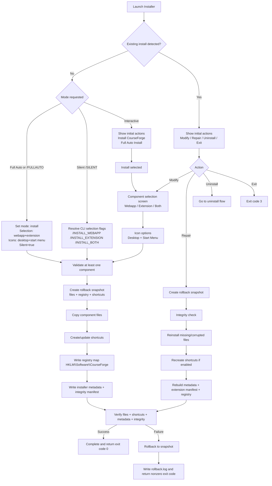
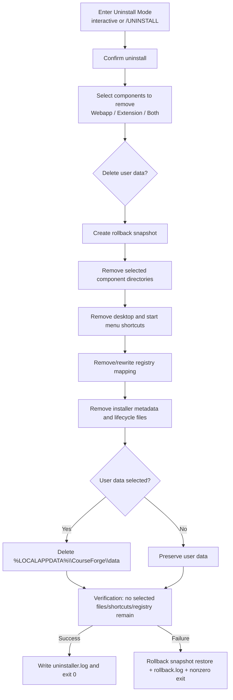
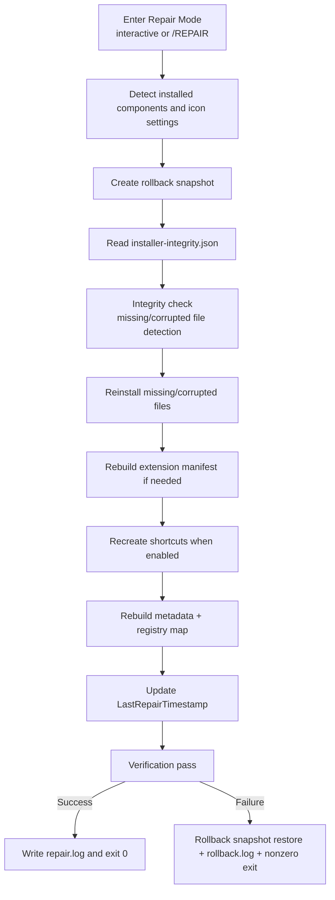

# Installer Lifecycle Flowcharts

## Install / Modify / Full Auto / Silent Flow

```mermaid
flowchart TD
  A[Launch Installer] --> B{Existing install detected?}
  B -- No --> C{Mode requested}
  C -- Full Auto or /FULLAUTO --> D[Set mode: install\nSelection: webapp+extension\nIcons: desktop+start menu\nSilent=true]
  C -- Silent /SILENT --> E[Resolve CLI selection flags\n/INSTALL_WEBAPP /INSTALL_EXTENSION /INSTALL_BOTH]
  C -- Interactive --> F[Show initial actions\nInstall CourseForge\nFull Auto Install]
  F --> G[Install selected]
  G --> H[Component selection screen\nWebapp / Extension / Both]
  H --> I[Icon options\nDesktop + Start Menu]
  E --> J[Validate at least one component]
  D --> J
  I --> J
  J --> K[Create rollback snapshot\nfiles + registry + shortcuts]
  K --> L[Copy component files]
  L --> M[Create/update shortcuts]
  M --> N[Write registry map HKLM\\Software\\CourseForge]
  N --> O[Write installer metadata + integrity manifest]
  O --> P[Verify files + shortcuts + metadata + integrity]
  P -- Success --> Q[Complete and return exit code 0]
  P -- Failure --> R[Rollback to snapshot]
  R --> S[Write rollback.log and return nonzero exit code]

  B -- Yes --> T[Show initial actions\nModify / Repair / Uninstall / Exit]
  T --> U{Action}
  U -- Modify --> H
  U -- Repair --> V[Create rollback snapshot]
  V --> W[Integrity check]
  W --> X[Reinstall missing/corrupted files]
  X --> Y[Recreate shortcuts if enabled]
  Y --> Z[Rebuild metadata + extension manifest + registry]
  Z --> P
  U -- Uninstall --> AA[Go to uninstall flow]
  U -- Exit --> AB[Exit code 3]
```

## Uninstall Flow

```mermaid
flowchart TD
  A[Enter Uninstall Mode\ninteractive or /UNINSTALL] --> B[Confirm uninstall]
  B --> C[Select components to remove\nWebapp / Extension / Both]
  C --> D{Delete user data?}
  D --> E[Create rollback snapshot]
  E --> F[Remove selected component directories]
  F --> G[Remove desktop and start menu shortcuts]
  G --> H[Remove/rewrite registry mapping]
  H --> I[Remove installer metadata and lifecycle files]
  I --> J{User data selected?}
  J -- Yes --> K[Delete %LOCALAPPDATA%\\CourseForge\\data]
  J -- No --> L[Preserve user data]
  K --> M[Verification: no selected files/shortcuts/registry remain]
  L --> M
  M -- Success --> N[Write uninstaller.log and exit 0]
  M -- Failure --> O[Rollback snapshot restore + rollback.log + nonzero exit]
```

## Repair Flow

```mermaid
flowchart TD
  A[Enter Repair Mode\ninteractive or /REPAIR] --> B[Detect installed components and icon settings]
  B --> C[Create rollback snapshot]
  C --> D[Read installer-integrity.json]
  D --> E[Integrity check\nmissing/corrupted file detection]
  E --> F[Reinstall missing/corrupted files]
  F --> G[Rebuild extension manifest if needed]
  G --> H[Recreate shortcuts when enabled]
  H --> I[Rebuild metadata + registry map]
  I --> J[Update LastRepairTimestamp]
  J --> K[Verification pass]
  K -- Success --> L[Write repair.log and exit 0]
  K -- Failure --> M[Rollback snapshot restore + rollback.log + nonzero exit]
```
